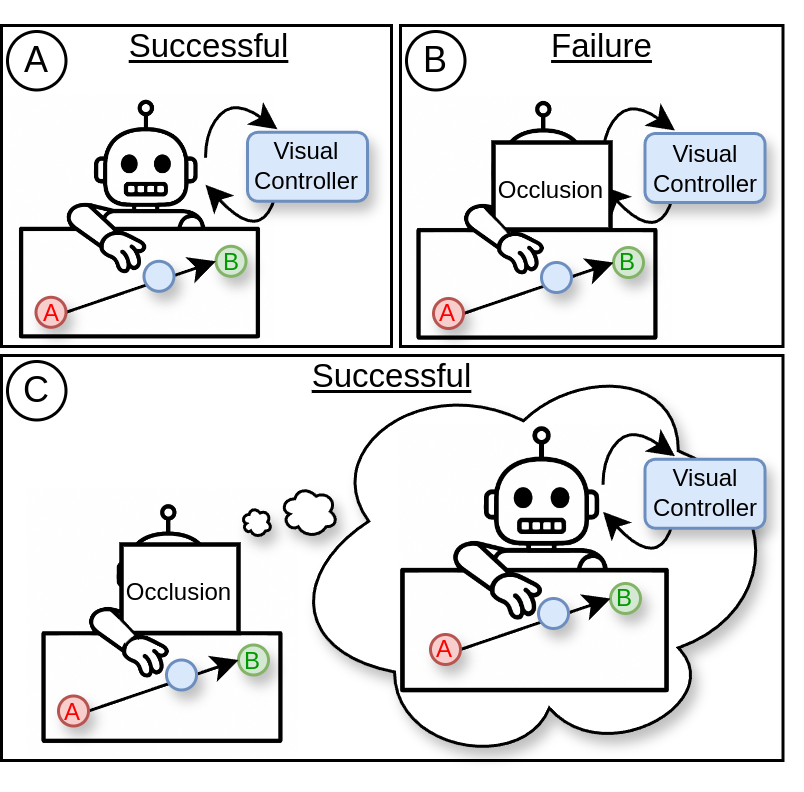
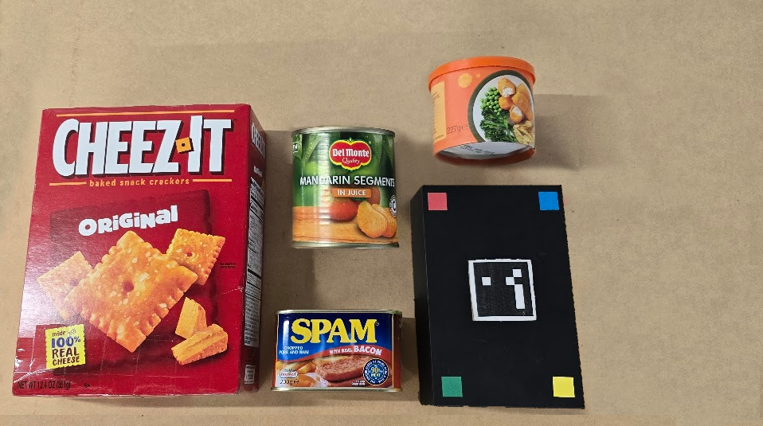
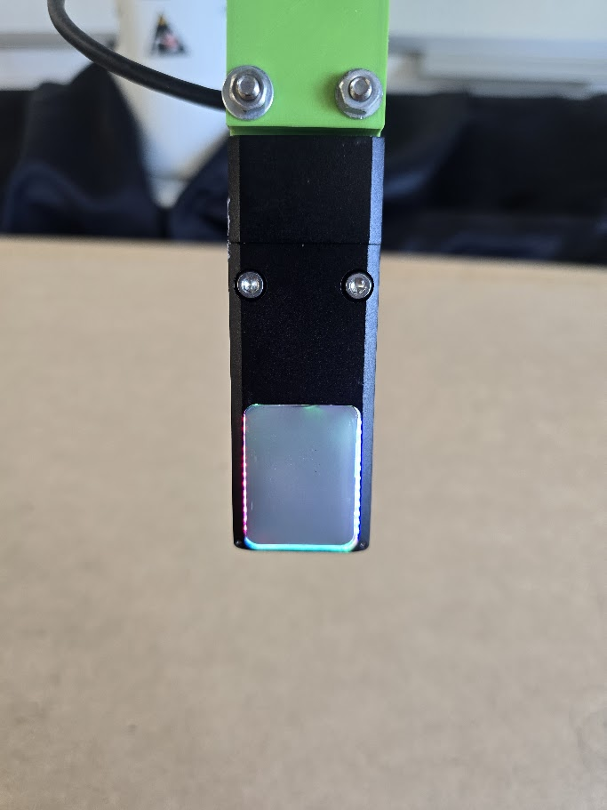
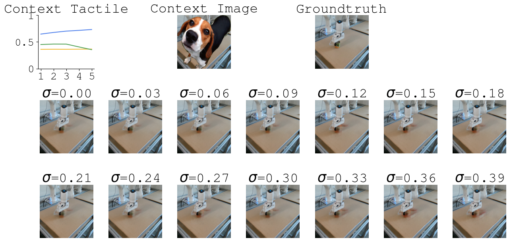

# CM World Model: Cross-Modal World Models for Occlusion Handling in Robotic Manipulation

> **Predicting Visual States from Tactile Feedback for Occlusion Handling in Robotic Manipulation**

[](https://ieeexplore.ieee.org/xpl/RecentIssue.jsp?punumber=8856)
[](https://www.python.org/downloads/)
[](https://pytorch.org/)
[](LICENSE)

---

## Overview

**CM World Model (CM-WM)** is a multimodal prediction framework that leverages tactile sensing to reconstruct occluded visual information during robotic manipulation.

By fusing visual observations, tactile feedback, and robot actions through an autoregressive spatio-temporal transformer, CM-WM provides accurate long-horizon predictions of future scene states. This enables existing vision-based controllers to continue operating robustly even under severe partial or complete visual occlusion, without controller retraining.

Inspired by human sensorimotor integration, the framework maps tactile feedback into visual representations so that robots can maintain reliable perception when visual input becomes unreliable.

---

## Motivation and Overview

### Why does this matter?

### (A) Normal vision-based pushing
Standard vision-based controllers work well when the object remains visible.

### (B) Visual occlusion problem
During manipulation, the robot arm, tool, or clutter can fully occlude the object, causing vision-based control to fail.

### (C) Our solution
Inspired by human visuo-tactile reasoning, we use tactile sensing to reconstruct the hidden visual scene and preserve controller performance.

<p align="center">
  
</p>

---

## System Overview

### Training Pipeline

The model learns to infill visual occlusions using tactile feedback.

Occluded visual frames, tactile observations, robot states, and future actions are jointly processed using a multimodal spatio-temporal transformer.

The model reconstructs both visual and tactile states while predicting future scene evolution.

<p align="center">
  
</p>

### Transformer Architecture

Visual patches and tactile tokens are embedded and processed using a causal transformer architecture that prevents access to future information during rollout prediction.

<p align="center">
  
</p>

---

## Experimental Setup

### Object Set Used in This Paper

<p align="center">
  
</p>

### GelSight Sensor Used in the Experiments

<p align="center">
  
</p>

The robot physically interacts with household objects using tactile sensing while visual observations may be heavily occluded.

---

## Qualitative Results

## 1. Primitive Occlusion Example

Full visual occlusion at test time.

The model must reconstruct the object using tactile feedback and action history alone.

<p align="center">
  
</p>

This is the strongest evaluation of true occlusion-aware visual recovery.

---

## 2. Complex Occlusion Example

Realistic partial occlusions using segmentation masks from Open Images.

<p align="center">
  
</p>

The model combines partial visual context with tactile sensing to maintain accurate object tracking.

---

## 3. SPOTS-SVG Baseline Failure

Failure case of the recurrent baseline under severe occlusion.

<p align="center">
  
</p>

The recurrent baseline struggles to remove occlusions and preserve object identity over long horizons.

CM World Model remains stable and temporally consistent.

---

## 4. Noise Robustness

Robustness analysis under increasing tactile noise.

<p align="center">
  
</p>

As tactile quality degrades, visual prediction quality also degrades, confirming that tactile sensing directly drives performance.

---

## 5. GelSight vs Xela Comparison

Comparison between high-resolution vision-based tactile sensing and lower-dimensional force-based tactile sensing.

<p align="center">
  
</p>

GelSight produces sharper boundaries and better localisation, while Xela still provides strong improvements over vision-only baselines.

---

## Key Features

- Cross-modal fusion of visual and tactile sensing
- Long-horizon prediction under persistent occlusion
- Action-conditioned rollouts compatible with MPC
- Simultaneous visual and tactile prediction during training
- Support for GelSight and Xela tactile sensors
- Plug-and-play with existing vision-based controllers
- No controller retraining required
- Inference time approximately 30 ms per rollout on RTX 4090

---

## Method

CM World Model combines three core ideas:

1. **Spatio-temporal transformer backbone** adapted from ViViT for autoregressive prediction
2. **Multimodal fusion** using self-attention with strict causal masking
3. **Simultaneous visual and tactile prediction** during training for stronger physical interaction modelling

### Inputs and Outputs

```text
Inputs:
Occluded visual frames + tactile frames + robot actions

Outputs:
Predicted future visual frames + tactile prediction as auxiliary supervision
```

During deployment, only visual predictions are consumed by downstream controllers.

---

## Datasets

Two datasets are collected using a Franka Emika Panda robot at 10 FPS.

| Dataset | Sensor | Type | Resolution |
|---|---|---|---|
| Xela | Xela uSkin | Force-based magnetic tactile sensing | 4×4 taxels |
| GelSight | GelSight | Vision-based tactile sensing | 224×224×3 RGB |

Each trajectory includes:

- RGB-D scene observations
- tactile observations
- end-effector pose and actions

### Occlusion Regimes

### Primitive
Random square masks during training and full occlusion during testing.

### Complex
Real segmentation masks from Open Images v7.

---

## Training

### Xela

```bash
python train.py --config config/config_base_model.py
```

### GelSight

```bash
python train_gelsight.py --config config/config_base_model_gelsight.py
```

### Multiple Experiments

```bash
bash multi_runner.sh
```

### Main Hyperparameters

| Parameter | Value |
|---|---|
| Encoder dimension | 756 |
| Attention heads | 12 |
| Patch size | 16 |
| Dropout | 0.2 |
| Batch size | 256 |
| Learning rate | 0.001 |
| Loss weights α, β | 0.5, 0.5 |
| Context frames | 5 |
| Prediction horizon | 15 |

---

## Evaluation

```bash
python playground.py
```

or

```bash
jupyter notebook playground.ipynb
```

### Metrics

- MAE
- MSE
- SSIM

All results are reported over 15-frame rollout prediction horizons.

---

## Baselines

| Model | Description |
|---|---|
| CM World Model | Multimodal transformer (ours) |
| ViViT | Vision-only transformer |
| SPOTS-SVG | Multimodal recurrent baseline |
| SVG | Vision-only recurrent baseline |

---

## Results

CM World Model consistently outperforms both vision-only and recurrent baselines.

### Primitive Occlusions Example

| Model | Sensor | MAE ↓ | MSE ↓ | SSIM ↑ |
|---|---|---:|---:|---:|
| CM World Model | GelSight | **0.009** | **0.00026** | **0.985** |
| ViViT | — | 0.020 | 0.00341 | 0.923 |
| CM World Model | Xela | **0.012** | **0.00091** | **0.963** |
| ViViT | — | 0.035 | 0.00433 | 0.894 |
| SPOTS-SVG | Xela | 0.132 | 0.03124 | 0.459 |

---

## Runtime

Measured on NVIDIA RTX 4090.

| Component | Time |
|---|---|
| Preprocessing | ~5 ms |
| Single rollout | ~25 ms |
| MPC batch (128 actions) | ~1.13 s |

Suitable for medium-frequency control. Future work includes model compression for high-speed applications.

---

## Installation

```bash
git clone https://github.com/<your-username>/cm_world_model.git
cd cm_world_model

conda create -n cm_world_model python=3.8
conda activate cm_world_model

pip install -r environment.txt
```

Tested on NVIDIA RTX 4090 with CUDA support.

---

## Citation

```bibtex
@article{cmworldmodel2026,
  title={Cross-Modal World Models: Predicting Visual States from Tactile Feedback for Occlusion Handling in Robotic Manipulation},
  journal={IEEE Transactions on Automation Science and Engineering},
  year={2026}
}
```

---

## License

MIT License.

See `LICENSE` for details.

---

## Acknowledgements

- GelSight tactile sensing
- ViViT transformer backbone
- SPOTS-SVG prior multimodal baseline
- Open Images v7 segmentation masks

---

